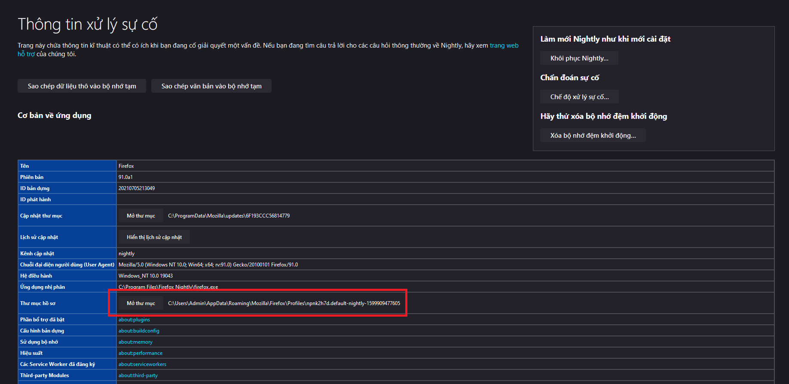

<h1>Personal Firefox CSS</h1>

## Installation

Find Firefox's profile folder at `about:support » Profile Folder » Open Folder`, **create a folder called `chrome` inside if it not exist**

Next, copy `user.js` to **Firefox's PROFILE FOLDER**, then copy everything else to **the `chrome` folder inside your Firefox's profile folder**

## Overlay Scrollbar

**[Installation Guide](overlay_scrollbar/README.md)**