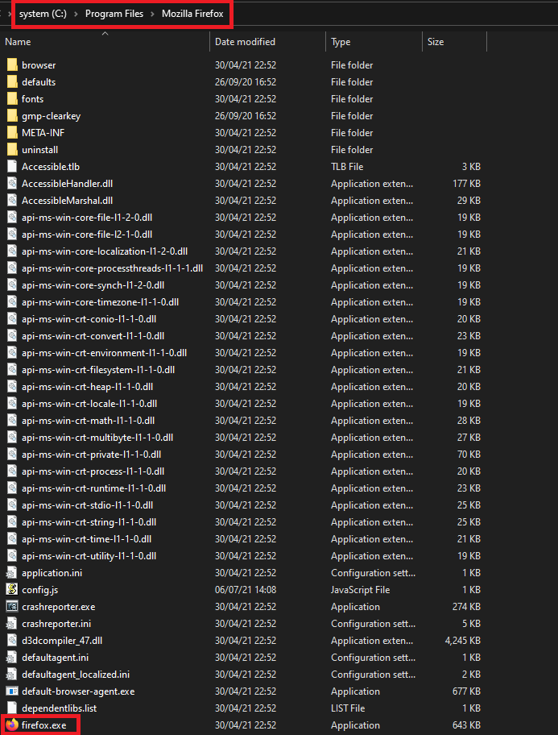
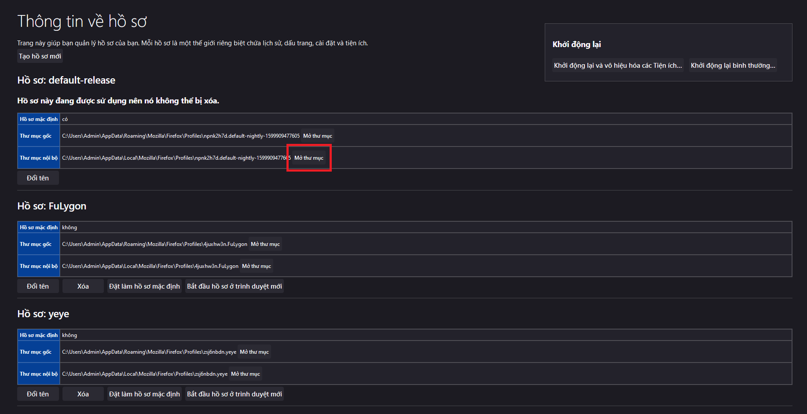

<h1>Enable Firefox Overlay Scrollbars</h1>

## Installation

To begin with, **copy the `defaults` folder and `config.js` from `overlay_scrollbar` folder to Firefox's installation directory**, where `firefox.exe` is.

Next, close all instances of Firefox, and **delete Firefox's old script/startup cache** at `about:profiles » Local Directory » Open Folder`

Made by Spencer Woo.

[@Portfolio](https://spencerwoo.com/) · [@Blog](https://blog.spencerwoo.com/) · [@GitHub](https://github.com/spencerwooo)
